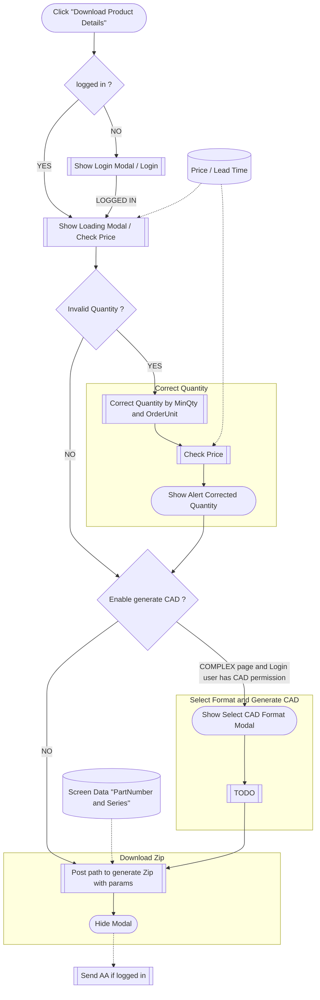

```mermaid
flowchart TD

START([Click ''Download Product Details'']) --> Q1{ logged in ?}
Q1 -- YES --> PRICE_CHECK1[[Show Loading Modal / Check Price]]
Q1 -- NO --> LOGIN[[Show Login Modal / Login]]
LOGIN -- LOGGED IN --> PRICE_CHECK1
PRICE_CHECK1 --> Q2{Invalid Quantity ?}
PRICE_CHECK_API[(Price / Lead Time)] -.-> PRICE_CHECK1
Q2 -- YES --> CORRECT_QTY1[[Correct Quantity by MinQty and OrderUnit]]

subgraph Correct Quantity
CORRECT_QTY1 --> CORRECT_QTY2[[Check Price]]
CORRECT_QTY2 --> CORRECT_QTY3([Show Alert Corrected Quantity])
end

PRICE_CHECK_API[(Price / Lead Time)] -.->  CORRECT_QTY2[[Check Price]]
Q2 -- NO --> Q3{Enable generate CAD ?}
CORRECT_QTY3 --> Q3

Q3 -- COMPLEX page and Login user has CAD permission --> DL_CAD1[TODO]
Q3 -- NO --> DOWNLOAD1[[Post path to generate Zip with params]]

subgraph Download Zip
DOWNLOAD1 --> DOWNLOAD2([Hide Modal])
end

PRODUCT_INFO[(Screen Data ''PartNumber and Series'')] -.-> DOWNLOAD1
DOWNLOAD2 -.-> AA[[Send AA if logged in]]

subgraph Select Format and Generate CAD
DL_CAD1([Show Select CAD Format Modal]) --> DL_CAD2[[TODO]]
end

DL_CAD2 --> DOWNLOAD1

```
