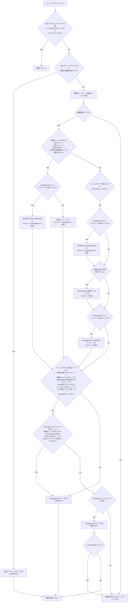
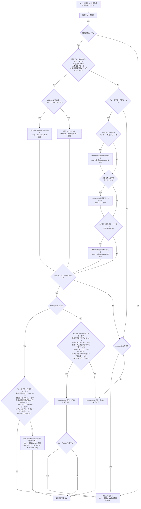

# FlowChart

## 文言定義

- モーダル A = showMessage (選択肢を表示せず、メッセージを表示するだけ)
- モーダル B = showConfirm (Next / Close の選択肢を表示し、ユーザの選択によって次の動作を決定する)

## Checkout flowChart

## Add to cart or Add to my component flowchart

- 前提条件
  - ログイン済みまたはチェックイン済み

